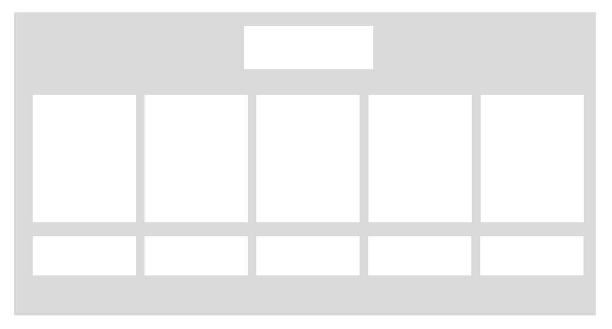
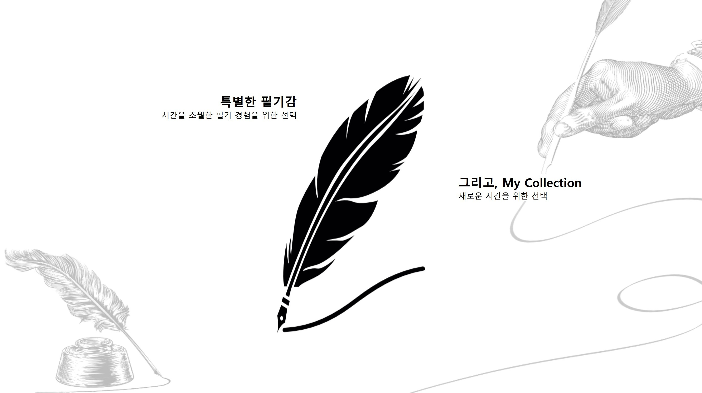
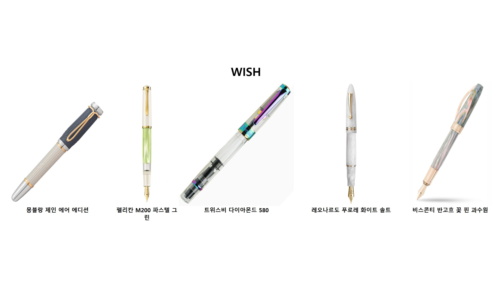
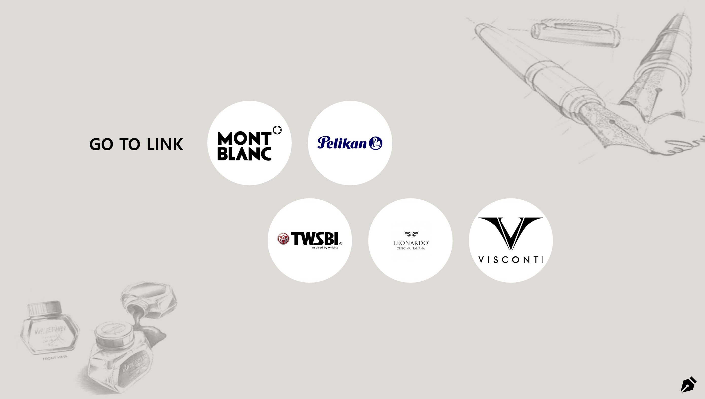

# 만년필 위시리스트

평소 소유하고 싶었던 만년필과 그 브랜드를 소개한 사이트.

## 목표

1. 사이트 주제 선정
2. 스스로 레이아웃 구상하기

### 진행방식

사이트 주제 선정 > 사이트 제작 계획 > 레이아웃 구상하기 > 사이트 배포 > 사이트 제작

## 기획

전체 스크롤 크기를 크게 잡았기 때문에 편의성을 키우기 위해 네비게이션을 화면 상단에 고정시킨다. 왼쪽 상단에는 로고를, 중앙에는 각 페이지로 이동할 수 있는 컨텐츠들을 삽입한다.

단순한 구성에서 벗어나 색다른 구성을 해 보고자 텍스트 사이인 중앙에 세로가 긴 이미지 파일을 삽입한다.

가지고 싶은 5가지의 만년필을 간단하고 깔끔하게 정리하는 데 초점을 둔다. 위쪽 중앙에 타이틀을 삽입하고 아래에 가로로 5개로 나눈 후 이미지와 이름을 삽입한다.

링크가 삽입된 브랜드 로고 이미지 5개를 위, 아래로 교차하여 나열한다. 여백을 최소화 하기 위해 왼쪽 상단에는 큰 글씨로 타이틀을 넣고 오른쪽 하단에는 로고를 삽입한다.

## 서비스

### 네비게이션

- 중앙에 home, about, contact 네비게이션을 삽입
- 화면의 상단 위치에 네비게이션 고정

기획에는 왼쪽 상단에 로고가 있었지만 큰 기능이 없어 제거하였다.

### 홈

- 배경 이미지 위에 세로가 긴 만년필 아이콘 이미지, 텍스트를 쌓음
- 만년필 이미지를 중앙에, 텍스트를 양 옆에 엇갈리게 배치

단조로운 구성에서 벗어나기 위해 그림을 텍스트 사이에 끼우고 텍스트를 엇갈리게 배치하게 하는 등의 노력을 하였다.

### 위시

- 상단에 타이틀 삽입
- 하단에 위시 펜 5개의 이미지와 이름을 가로로 나열하여 삽입

디자인적인 도전을 하기보다 단순하게 구성해 컨텐츠를 깔끔히 보여줄 수 있게 하였다.

### 링크

- 배경 이미지 위에 로고 이미지와 타이틀 등의 컨텐츠를 쌓음
- 5개의 브랜드 로고 이미지에 링크를 삽입
- 동그란 로고 이미지를 위, 아래로 엇갈리게 나열
- 상단부 로고 이미지 왼쪽에 섹션의 타이틀 삽입
- 배경의 맨 오른쪽 아래에 만년필 로고 이미지 삽입

사이트의 메인 컨텐츠가 아닌 부가적인 설명 컨텐츠임을 강조하기 위해 회색 배경을 선택하였다.

## 개선된 점

- 스크롤을 내리면 네비게이션도 위로 올라가며 네비게이션을 이용하려면 다시 스크롤을 올려야 한다는 점이 불편했다.

  > position을 이용해 네비게이션을 화면의 상단 위치에 고정하였다.

- 네비게이션 부분의 디자인이 투박해 오히려 눈에 띄어 보완하면 더 좋을 것 같다.

  > 네비게이션의 폰트의 색깔과 밑줄을 수정하였다.

- 홈과 컨택 화면의 배경 크기가 적절하지 않아 화면 크기가 일관되지 않은 점, 각 페이지의 크기를 따로 지정해두지 않아 기본 화면 크기에서 아래 컨텐츠 또한 잘려서 보이는 점이 아쉬웠다.

  > 배경 이미지의 크기를 모두 윈도우 화면 기본 크기로 제작하였으며, 각 페이지들의 크기를 화면 크기로 지정해 주었다.

## 아쉬운 점

- 네비게이션의 디자인을 더 화려하게 보완하면 좋을 것 같다.
- 메인 컨텐츠 부분의 가독성을 위해 단순하게 구성하고자 함은 좋았으나 무성의하게 느껴지는 면이 있어 디자인적으로 보완하면 좋을 것 같다.
- 창 크기를 조절하면 컨텐츠들이 의도한 바와 다르게 보이는 점이 아쉽다.
